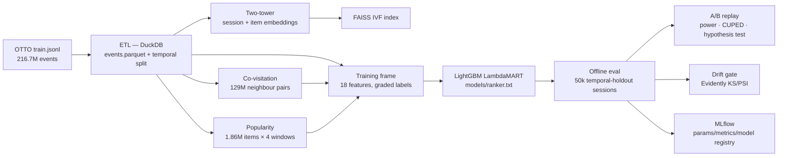
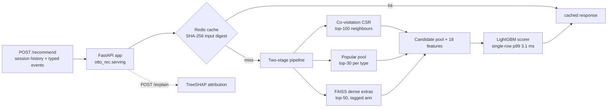

# Relevio

*Two-stage e-commerce recommender + search platform built on the public OTTO dataset.*

[2026-10-01]


An end-to-end e-commerce **recommender + search platform** built on the public OTTO
dataset (216.7M events, 12.9M sessions). It combines **hybrid candidate retrieval**
(co-visitation, popularity, BM25, two-tower dense/ANN) with a **multi-objective
LightGBM LambdaMART ranker**, evaluates everything with **temporal offline IR
metrics**, serves results through a **FastAPI + Redis** API with **FAISS** dense
extras and **TreeSHAP** explanations, and closes the loop with a **simulated A/B
experimentation layer** and **data-drift monitoring**.

> Project context, approved decisions, milestones, and changelog live in the workspace
> at `My Projects/OTTO Recommender and Search Platform - mimo-v2.6-flash-free/README.md`.

**Status:** all milestones M0–M6 are complete and were run end-to-end on the full
dataset — offline eval OTTO weighted Recall@20 **0.0805** (+18% over co-visitation);
two-tower valid hit@1 **0.614**; FAISS recall@100 **0.784** vs exact; serving p99
**24.5 ms** (server-side, Docker) vs the 50 ms budget; drift gate **PASS**;
`docker compose up` verified; lint + compile + **74 tests** green.

---

## Contents

1. [Architecture](#architecture)
2. [Repository layout](#repository-layout)
3. [Module map](#module-map)
4. [Technology stack](#technology-stack)
5. [Offline pipeline](#offline-pipeline)
6. [Retrieval](#retrieval)
7. [Ranking](#ranking)
8. [Offline evaluation](#offline-evaluation)
9. [Serving API](#serving-api-m4)
10. [Experimentation](#experimentation-m5)
11. [Drift monitoring](#drift-monitoring-m6)
12. [MLOps (Docker, MLflow, CI)](#mlops)
13. [Quickstart](#quickstart)
14. [Configuration reference](#configuration-reference)
15. [Make targets](#make-targets)
16. [Milestones](#milestones)

---

## Architecture

Two planes: an **offline plane** that turns raw events into artifacts (features,
models, indexes, reports) and an **online plane** that serves ranked candidates
from those artifacts. Experimentation and monitoring sit on top of the offline
reports.

### Offline plane



### Online plane



### Plane × layer overview

| Plane | Layer | Component | Technology |
|---|---|---|---|
| Offline | Ingestion / ETL | streaming parquet export + 80/20 temporal split | DuckDB |
| Offline | Retrieval (sparse) | co-visitation neighbours, popularity pools | DuckDB (bucketed self-join) |
| Offline | Retrieval (dense) | two-tower embeddings, ANN index | PyTorch, FAISS |
| Offline | Ranking | multi-objective GBDT scorer | LightGBM LambdaMART |
| Offline | Evaluation | temporal IR metrics + per-session outcomes | numpy / pandas |
| Offline | Experimentation | arm split, power, CUPED, assumption-checked tests | stdlib + SciPy |
| Offline | Monitoring | data-drift report + fail-closed gate | Evidently |
| Online | API | recommend / search / explain / health | FastAPI + Uvicorn |
| Online | Cache | SHA-256 digest response cache | Redis |
| Online | Explainability | per-candidate feature attribution | SHAP (TreeSHAP) |
| MLOps | Packaging | single-image stack (+ optional Airflow) | Docker Compose |
| MLOps | Tracking | params / metrics / model registry | MLflow (SQLite) |
| MLOps | Quality gate | lint + syntax + unit tests | Ruff, GitHub Actions |

---

## Repository layout

```text
.
├── configs/                   # Feast / model / eval YAML configs
├── dags/                      # Airflow DAGs (feature ETL, training, eval)
├── src/otto_rec/
│   ├── features/              # ETL + Feast feature definitions (M1)
│   ├── retrieval/             # co-visitation, popularity, BM25, two-tower, FAISS (M2)
│   ├── ranking/               # LightGBM LambdaMART training (M3)
│   ├── evaluation/            # temporal split + IR metrics (M4)
│   ├── serving/               # FastAPI app + two-stage serving pipeline (M4)
│   ├── experimentation/       # arm assignment, power, CUPED, hypothesis test (M5)
│   └── monitoring/            # Evidently drift reports (M6)
├── scripts/                   # download, sample generator, eval, A/B, ANN, drift, MLflow
├── tests/                     # stdlib unittest (74 tests, no third-party needed)
├── reports/                   # generated: offline_eval.json, ab_replay.json, drift, ANN quality
├── docker-compose.yml         # api + redis + mlflow (+ airflow via profile)
├── Dockerfile                 # serving image (python:3.12-slim + libgomp1)
├── Makefile                   # one command per stage
└── .github/workflows/         # ci.yml (lint+tests), cd.yml (image publish)
```

## Module map

| Module | Responsibility | Key output |
|---|---|---|
| `otto_rec/features/etl` | stream `train.jsonl` → typed parquet, temporal 80/20 split | `events.parquet`, `sessions_meta.parquet`, `split.json` |
| `otto_rec/retrieval/covisitation` | directed item→item co-occurrence, gap-capped, min 2, top-100 | `neighbours.parquet` (129,279,774 pairs) |
| `otto_rec/retrieval/popularity` | per-type counts for all-time / 7d / 30d / 90d windows | `popularity.parquet` (1,855,603 items) |
| `otto_rec/retrieval/lexical` | Okapi BM25 (pure stdlib) — the lexical arm of hybrid retrieval | `BM25Okapi` class |
| `otto_rec/retrieval/two_tower` | dual-encoder training, in-batch softmax | `models/two_tower/{item_embeddings.npy, item_ids.parquet, session_tower.npz}` |
| `otto_rec/ranking/train` | candidate feature frame + LambdaMART training | `models/ranker.txt` |
| `otto_rec/evaluation` | IR metrics, temporal holdout, weighted OTTO metric | metrics dicts |
| `scripts/evaluate.py` | runs all systems on the same 50k sessions | `reports/offline_eval.json`, `session_outcomes.parquet` |
| `scripts/run_ab_replay.py` | offline A/B simulation with guardrails | `reports/ab_replay.json` |
| `scripts/build_ann.py` | FAISS index build + quality report | `models/two_tower/faiss.index` + `reports/ann_quality.json` |
| `otto_rec/serving/app` | HTTP API, cache, loaders, explain | FastAPI app |
| `otto_rec/serving/pipeline` | two-stage candidate construction + scoring | ranked candidates |
| `otto_rec/experimentation/*` | assignment, power, CUPED, hypothesis test | analysis reports |
| `otto_rec/monitoring/drift` | temporal-half drift comparison + gate | `reports/drift.html`, `drift.json` |
| `scripts/monitor_drift.py` | CLI wrapper for the drift gate | PASS/FAIL decision |
| `scripts/log_mlflow.py` | log run + optional registry push | MLflow run (`mlflow.db`) |

## Technology stack

| Concern | Choice |
|---|---|
| Language / runtime | Python 3.12 |
| ETL / feature SQL | DuckDB (6 GB budget, disk spilling) |
| Data handling | pandas, pyarrow, numpy |
| Sparse retrieval | co-visitation + popularity (SQL-backed), Okapi BM25 lexical arm |
| Dense retrieval | two-tower MLP (PyTorch), FAISS IVFFlat |
| Learning to rank | LightGBM LambdaMART (graded labels, label gain `[0,1,3,7]`) |
| Serving | FastAPI + Uvicorn, Redis cache |
| Explainability | SHAP (TreeSHAP, additivity-verified) |
| Experimentation | deterministic arm split, power analysis, CUPED, SciPy hypothesis tests |
| Monitoring | Evidently (KS/PSI drift report), fail-closed gate |
| Tracking | MLflow (SQLite backend, model registry `otto-ranker`) |
| Orchestration | Makefile; Airflow DAGs behind a Compose profile |
| Quality | Ruff (`E4/E7/E9/F/UP/DTZ/BLE/S`), stdlib unittest, GitHub Actions CI |
| Packaging | Docker Compose (`api`, `redis`, `mlflow`; `orchestration` profile adds `postgres` + `airflow`) |

---

## Offline pipeline

Data (no competition-rules acceptance needed — use the dataset API, then extract to
`data/raw/otto/train.jsonl`):

```bash
kaggle datasets download -d otto/recsys-dataset -f otto-recsys-train.jsonl -p data/raw/otto
```

One command runs every stage:

```bash
make pipeline   # etl -> covis -> popularity -> train -> eval -> ab
```

Each stage also runs standalone (prefix with `PYTHONPATH=src`):
`python -m otto_rec.features.etl`, `python -m otto_rec.retrieval.covisitation`,
`python -m otto_rec.retrieval.popularity`, `python -m otto_rec.ranking.train`,
`python scripts/evaluate.py`, `python scripts/run_ab_replay.py`.
Reports land in `reports/` (`offline_eval.json`, `session_outcomes.parquet`,
`ab_replay.json`).

### Stage results on the full dataset

216.7M events / 12.9M sessions, default budgets (6 GB DuckDB memory, 8 build
buckets, 16 merge partitions):

| Stage | What it produces | Result | Time |
|---|---|---|---|
| ETL | parquet events + temporal split | 216,716,096 events → 2.45 GB | ~17 min |
| Popularity | 4 recency windows per type | 1,855,603 items | ~4.5 min |
| Co-visitation | directed neighbour pairs | 129,279,774 pairs / 1,854,438 items (882 MB) | — |
| Ranker | LambdaMART model | valid NDCG@10 0.682 / NDCG@20 0.703 | — |
| Offline eval | metrics + session outcomes | 50k sessions scored, 6.3M candidate rows | 41 s |
| A/B replay | experiment report | adequately powered, inconclusive, guardrail pass | ~6 s |

> **Scalability note.** A single co-visitation self-join over 216M events exceeds
> the 6 GB memory budget (build side ≈ 6.5 GB), so the build is **session-hash
> bucketed** (8 buckets, partials ≈ 221M pairs / 2.76 GB each) with a **16-way
> item-hash merge** executed as two fresh-connection statements per partition
> (count aggregation, then top-N window). `--buckets` and `--merge-start` resume
> an interrupted build.

---

## Retrieval

### Sparse: co-visitation + popularity

- **Co-visitation:** directed item→item pairs from sessions, gap-capped, minimum
  co-occurrence 2, top-100 neighbours per item sorted by score DESC / item ASC
  (the tie-break is identical in training, evaluation and serving).
- **Popularity:** per-type counts over all-time / 7d / 30d / 90d windows; the
  serving pool takes the top-30 per event type.
- **Lexical (BM25):** an Okapi BM25 implementation in pure stdlib
  (`otto_rec/retrieval/lexical.py`) completes the hybrid-retrieval design as the
  lexical arm; it is exercised by the unit tests, while `/search` uses dense
  two-tower retrieval because the OTTO dataset has no text corpus to index.

### Dense: two-tower + FAISS (M2-advanced)

```bash
make two-tower   # python -m otto_rec.retrieval.two_tower
make ann         # scripts/build_ann.py (index + quality report)
```

| Setting | Value |
|---|---|
| Objective | in-batch softmax + uniform-noise negatives |
| Temperature | 0.07 |
| Optimizer | Adagrad, lr 0.01 (swept: 0.001 = chance, 0.003 = 23.9% hit@1, 0.01 = 56% on an 80k-session probe) |
| Training data | 400k temporal-holdout sessions → real run 736,066 examples / 1,855,603 items, ~18 min |
| Result | **valid hit@1 0.614** (random chance ≈ 0.00024) |
| Exports | `models/two_tower/{item_embeddings.npy, item_ids.parquet, session_tower.npz, faiss.index, faiss.index.ids.json}` |
| Serving forward pass | numpy-only (`session_query_vector`) — serving never imports torch |

| FAISS setting | Value |
|---|---|
| Index | IVFFlat, L2-normalised (cosine) |
| nlist / nprobe | 4096 / 512 (nprobe swept 64→512: recall@100 43%→78%, p50 0.85→4.4 ms) |
| Quality vs exact (n=2,000) | recall@10 **0.853**, recall@100 **0.784** |
| Next-item hit@100 | 0.2365 (exact brute force: 0.266) |

---

## Ranking

LightGBM LambdaMART is trained on the **same candidate pool the evaluator and the
server build** (session co-visitation neighbours ∪ per-type popular pool) so the
model learns to discriminate among exactly the distractors it will see in
production. Labels are graded from the last 30% of each session.

### Feature set (18 columns)

| Group | Features | # |
|---|---|---|
| Popularity (all-time) | `clicks_all`, `carts_all`, `orders_all`, `total_all` | 4 |
| Popularity (recency) | `clicks_30d`, `carts_30d`, `orders_30d`, `total_30d`, `total_7d`, `total_90d` | 6 |
| Co-visitation | `covis_score`, `covis_max` | 2 |
| Session | `n_events`, `n_clicks`, `n_carts`, `n_orders`, `span_ms` | 5 |
| History flag | `in_history` | 1 |

### Training configuration

| Setting | Value |
|---|---|
| Objective | LambdaMART, graded labels clicks=1 / carts=2 / orders=3 |
| Label gain | `[0, 1, 3, 7]` (OTTO weighting) |
| Train/valid split | hash-based session holdout |
| Frame | 100k sessions → 13.4M candidate rows (real run) |
| Valid metrics | NDCG@10 **0.682**, NDCG@20 **0.703** |
| Output | `models/ranker.txt` (booster file, loaded by eval + serving) |

---

## Offline evaluation

`PYTHONPATH=src python scripts/evaluate.py` scores all three systems
(popularity, co-visitation, two-stage) on the **identical holdout sessions** so the
comparison is fair.

| Setting | Value |
|---|---|
| Sessions | 50,000 temporal-holdout sessions |
| History rule | first 70% of session = history, last 30% = ground truth |
| Candidate rows | 6,300,880 (6.8 s frame build; 11.5 s scoring wall) |
| Cutoffs | k ∈ {5, 10, 20} |
| Metrics | Recall, Precision, Hit-rate, MRR, MAP, NDCG per type + macro + OTTO-weighted |
| Primary A/B metric | `hit20_clicks` (per-session binary top-20 click hit) |

### Results (50k holdout sessions)

| System | OTTO weighted R@20 | Macro R@20 | Macro NDCG@20 | Clicks hit-rate@20 |
|---|---|---|---|---|
| Popularity | 0.00238 | 0.00392 | 0.00197 | 0.01416 |
| Co-visitation | 0.06806 | 0.08823 | 0.05027 | 0.21082 |
| **Two-stage** | **0.08051** | **0.09928** | **0.06166** | **0.21933** |

### Recall@20 per ground-truth type

| System | clicks | carts | orders |
|---|---|---|---|
| Popularity | 0.00715 | 0.00330 | 0.00130 |
| Co-visitation | 0.11024 | 0.10836 | 0.04607 |
| **Two-stage** | **0.11473** | **0.12497** | **0.05814** |

**Take-away:** two-stage beats plain co-visitation everywhere (+18% on the OTTO
weighted metric, +55% on orders), and its advantage concentrates on carts/orders
and deeper ranks rather than binary top-20 click hits — which is exactly why the
A/B replay below reports an inconclusive primary metric.

### Scoring latency (offline, single-row LightGBM + top-K)

| p50 | p95 | p99 | Budget |
|---|---|---|---|
| 1.70 ms | 2.70 ms | 3.12 ms | 50 ms (guardrail) |

---

## Serving API (M4)

```bash
make serve   # PYTHONPATH=src uvicorn otto_rec.serving.app:app --port 8000
```

| Route | Method | Purpose |
|---|---|---|
| `/health` | GET | liveness + `pipeline` / `redis` / `ann` status, model version |
| `/recommend` | POST | session → two-stage ranked candidates (co-visitation ∪ popular ∪ ANN extras), Redis-cached by input digest |
| `/search` | POST | dense two-tower session retrieval when `history`/`events` are present; deterministic placeholder for query-only requests (OTTO has no text corpus) |
| `/explain` | POST | TreeSHAP attribution of one candidate's score |

### Request / response example

```json
POST /recommend
{
  "session_id": "s123",
  "k": 20,
  "history": ["item_a", "item_b"],
  "events": [
    {"item_id": "item_a", "etype": "clicks", "ts": 1664500000000},
    {"item_id": "item_c", "etype": "carts",  "ts": 1664500060000}
  ]
}
```

```json
{
  "session_id": "s123",
  "model_version": "untrained",
  "candidates": [
    {"item_id": "item_x", "score": 4.71, "sources": ["covisitation", "popularity"]}
  ],
  "latency_ms": 12.4
}
```

`sources` tags where a candidate came from: `covisitation`, `popularity`, `ann`
(dense extras), or `ranker` when none apply. `events` (typed: `clicks|carts|orders`)
is preferred over plain `history` when present.

### Startup behaviour

At boot the service loads `data/processed/{neighbours,popularity}.parquet` +
`models/ranker.txt`; the first start converts the 129M-pair neighbour graph into a
compact CSR cache under `data/processed/serving_cache/` (~90 s, ~2 GB peak RAM;
6.4 s warm reload), then loads the FAISS index when `SERVING_ANN=auto`.
Placeholder mode is used automatically when artifacts are absent, or forced with
`SERVING_PIPELINE=off`.

### Verified latency

| Environment | Metric | Value |
|---|---|---|
| Host uvicorn, warm | p50 / p95 / p99 | 5.2 / 5.4 / ≤12.6 ms |
| Docker, server-side `latency_ms`, uncached | p50 / p99 / max | 13.8 / 24.5 / 37.5 ms (budget 50 ms) |
| `/search` dense (Docker) | p50 | 14.5 ms |
| ANN extras in top-100 | coverage | 52/60 sessions, zero failures |

> Client-side timings through Windows → Docker's port proxy add 15–90 ms of
> transport; trust the server-reported `latency_ms`.

`/explain` costs ~2.5 s on the first call (shap import), ~35 ms warm.

---

## Experimentation (M5)

A simulated experimentation layer that mirrors how a real online test would be run
and analysed:

| Component | Purpose |
|---|---|
| `experimentation/assignment.py` | deterministic hash-bucket arm assignment (salt + fraction) |
| `experimentation/power.py` | required sample size for a relative MDE at α = 0.05 |
| `experimentation/cuped.py` | CUPED variance reduction with session length as covariate |
| `experimentation/hypothesis.py` | assumption-checked test: Shapiro-Wilk normality gates an independent t-test vs Mann-Whitney U; Levene picks equal-variance vs Welch |
| `scripts/run_ab_replay.py` | full replay: arm split → power → raw + CUPED effects → hypothesis test → latency guardrail → ship/hold/inconclusive |

### A/B replay result (real outcomes, 50k sessions)

| Input | Value |
|---|---|
| Arms | control = co-visitation, treatment = two-stage (deterministic 50/50) |
| Power | 24,925/arm observed vs 23,687 required (5% MDE) → adequately powered |
| Primary metric | `hit20_clicks`: +0.32%, Mann-Whitney U p = 0.853 |
| CUPED-adjusted | +0.34%, p = 0.876 (Shapiro rejected normality → rank test) |
| Guardrail | scoring latency p99 3.12 ms ≤ 50 ms → pass |
| **Recommendation** | **inconclusive** (two-stage's edge lives in graded/deeper metrics, not binary top-20 click hits) |

The Kaggle Facebook bidding dataset was analysed with the same `hypothesis.py`
module via `scripts/run_kaggle_ab.py` → `reports/kaggle_ab_report.json`
(report: `My Projects/OTTO Recommender and Search Platform - mimo-v2.6-flash-free/Kaggle AB Test Report.md`).

---

## Drift monitoring (M6)

```bash
make drift   # scripts/monitor_drift.py
```

Splits `reports/session_outcomes.parquet` into **temporal halves** (the identifier
`session_code` excluded from comparison), runs an Evidently data-drift report
(`reports/drift.html` + JSON summary; a builtin KS/PSI report is used when
Evidently is absent) and applies a **fail-closed gate**:

| Rule | Threshold |
|---|---|
| Column counts as drifted | KS p < 0.05 **and** PSI ≥ 0.1 |
| System fails | `drift_share` > 0.3 |
| Ambiguity | treated as failure (fail-closed) |

**Current run: PASS — 0/19 columns drifted.**

---

## MLOps

### Docker Compose

```bash
docker compose up --build                 # api + redis + mlflow
docker compose --profile orchestration up # + postgres + airflow
```

| Service | Image / role |
|---|---|
| `api` | `python:3.12-slim` + `libgomp1` (OpenMP for LightGBM/FAISS), serves FastAPI |
| `redis` | response cache |
| `mlflow` | tracking server (UI on :5000) |
| `postgres` + `airflow` | optional, `orchestration` profile |

Verified [2026-09-30]: image builds, all services start, `/health` reports
`{"pipeline": true, "redis": true, "ann": true}`, all four endpoints exercised
over HTTP, `docker compose down` clean.

### MLflow

```bash
make mlflow-log   # or: PYTHONPATH=src python scripts/log_mlflow.py --register
```

Logs params/metrics/model to `sqlite:///mlflow.db` (override with
`MLFLOW_TRACKING_URI`); `--register` pushed registry model **`otto-ranker` v1**.

### CI (GitHub Actions)

| Step | Command |
|---|---|
| Lint | `ruff check src dags scripts tests` |
| Syntax | `python -m compileall -q src dags scripts tests` |
| Tests | `PYTHONPATH=src python -m unittest discover -s tests -v` |

Runs on every push to `main` and on pull requests (ubuntu, Python 3.12).

### CD (GitHub Actions)

`.github/workflows/cd.yml` publishes the serving image to GitHub Container
Registry whenever **CI completes successfully on `main`** (also on manual
`workflow_dispatch`):

| Aspect | Value |
|---|---|
| Trigger | `workflow_run` on green CI (branch `main`) + manual dispatch |
| Registry | `ghcr.io/<owner>/<repo>` (authenticated with the built-in `GITHUB_TOKEN`) |
| Tags | `latest`, `main`, `<short-sha>` |
| Cache | GitHub Actions layer cache (`cache-from/to: type=gha`) |
| Permissions | `contents: read`, `packages: write` |

Pull it with `docker pull ghcr.io/youssef-amarzou/relevio:latest`.

---

## Quickstart

Unit tests need no third-party packages:

```powershell
$env:PYTHONPATH = "src"
python -m unittest discover -s tests -v
python -m compileall -q src dags scripts tests
```

```bash
PYTHONPATH=src python -m unittest discover -s tests -v
python -m compileall -q src dags scripts tests
```

Full stack:

```bash
make setup        # pip install -r requirements-train.txt
make pipeline     # etl -> covis -> popularity -> train -> eval -> ab
make serve        # API on :8000
make up           # docker compose up --build
```

**Requirements** — the lean API image installs only `requirements.txt`;
training/eval extras live in `requirements-train.txt` (which includes it):

| File | Contents |
|---|---|
| `requirements.txt` | fastapi, uvicorn, pydantic, redis, pandas, pyarrow, numpy, lightgbm, faiss-cpu, shap |
| `requirements-train.txt` | + duckdb, scipy, torch, feast, mlflow, evidently, httpx, ruff |

Credentials and endpoints go in `.env` (copy from `.env.example`); never commit
real values.

---

## Configuration reference

### `.env` (setup / orchestration)

| Variable | Purpose | Default in `.env.example` |
|---|---|---|
| `KAGGLE_USERNAME` / `KAGGLE_KEY` | dataset download credentials | empty |
| `REDIS_URL` | cache connection | `redis://localhost:6379/0` |
| `MLFLOW_TRACKING_URI` | tracking backend | `http://localhost:5000` |
| `MODEL_VERSION` | reported model version | `untrained` |
| `EXPERIMENT_SALT` | arm-assignment salt | `change-me` |

### Serving (API process)

| Variable | Purpose | Default |
|---|---|---|
| `PROCESSED_DIR` | artifact directory | `data/processed` |
| `MODEL_PATH` | ranker file | `models/ranker.txt` |
| `SERVING_PIPELINE` | `off` forces placeholder mode | on (auto) |
| `SERVING_ANN` | `auto` loads FAISS, `off` disables | `auto` |
| `TWO_TOWER_DIR` | embeddings / index directory | `models/two_tower` |
| `SERVING_ANN_TOP_K` | max dense extras per request | 50 |
| `REDIS_URL` | cache connection | `redis://localhost:6379/0` |
| `CACHE_TTL_SECONDS` | response-cache TTL | — |
| `MODEL_VERSION` | reported model version | `untrained` |

---

## Make targets

| Target | Runs |
|---|---|
| `setup` | `pip install -r requirements-train.txt` |
| `compile` | `python -m compileall -q src dags scripts tests` |
| `test` | stdlib unittest suite (74 tests) |
| `lint` | `ruff check src dags scripts tests` |
| `download` | `scripts/download_otto.py` (Kaggle dataset API) |
| `etl` | DuckDB ETL → `data/processed` |
| `covis` | co-visitation build → `neighbours.parquet` |
| `popularity` | popularity build → `popularity.parquet` |
| `two-tower` | two-tower training → `models/two_tower` |
| `ann` | FAISS index + quality report (depends on `two-tower`) |
| `train` | ranker training → `models/ranker.txt` |
| `eval` | offline evaluation → `reports/offline_eval.json` |
| `ab` | A/B replay → `reports/ab_replay.json` |
| `pipeline` | `etl covis popularity train eval ab` |
| `drift` | drift report + gate → `reports/drift.html` |
| `mlflow-log` | log run to MLflow |
| `serve` | Uvicorn on `:8000` |
| `up` / `down` | `docker compose up --build` / `docker compose down` |

---

## Milestones

| Milestone | Scope | Status |
|---|---|---|
| M0 | repo scaffold, IR metrics, A/B primitives, CI | done [2026-09-25] |
| M1 | DuckDB ETL, temporal split, Feast feature definitions | done [2026-09-25] |
| M2 | co-visitation + popularity retrieval | done [2026-09-25] |
| M3 | ranker training frame + LambdaMART | done [2026-09-25] |
| — | full-dataset run (216.7M events) | done [2026-09-30] |
| M4 | serving pipeline, FastAPI, Redis cache, SHAP explain, MLflow | done [2026-09-30] |
| M2-advanced | two-tower + FAISS + dense serving | done [2026-09-30] |
| M5 | A/B replay + hypothesis testing (incl. Kaggle dataset report) | done [2026-10-01] |
| M6 | drift monitoring, Docker verification | done [2026-09-30] |

---

## Documentation

| Document | Location |
|---|---|
| Project context, decisions, changelog | workspace `My Projects/OTTO Recommender and Search Platform - mimo-v2.6-flash-free/README.md` |
| Kaggle A/B test report | workspace `My Projects/OTTO Recommender and Search Platform - mimo-v2.6-flash-free/Kaggle AB Test Report.md` |
| Offline evaluation report | `reports/offline_eval.json` (generated) |
| A/B replay report | `reports/ab_replay.json` (generated) |
| ANN quality report | `reports/ann_quality.json` (generated) |
| Drift report | `reports/drift.html` + `reports/drift.json` (generated) |
